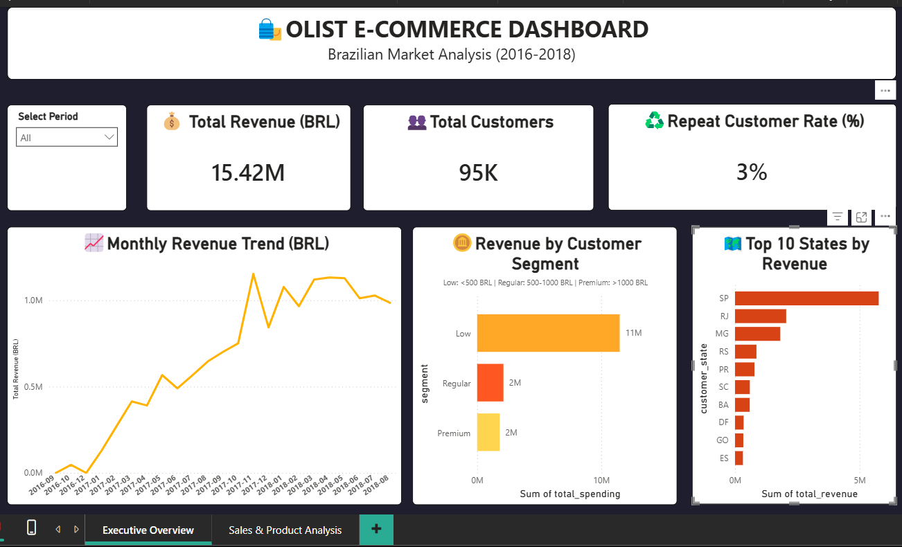
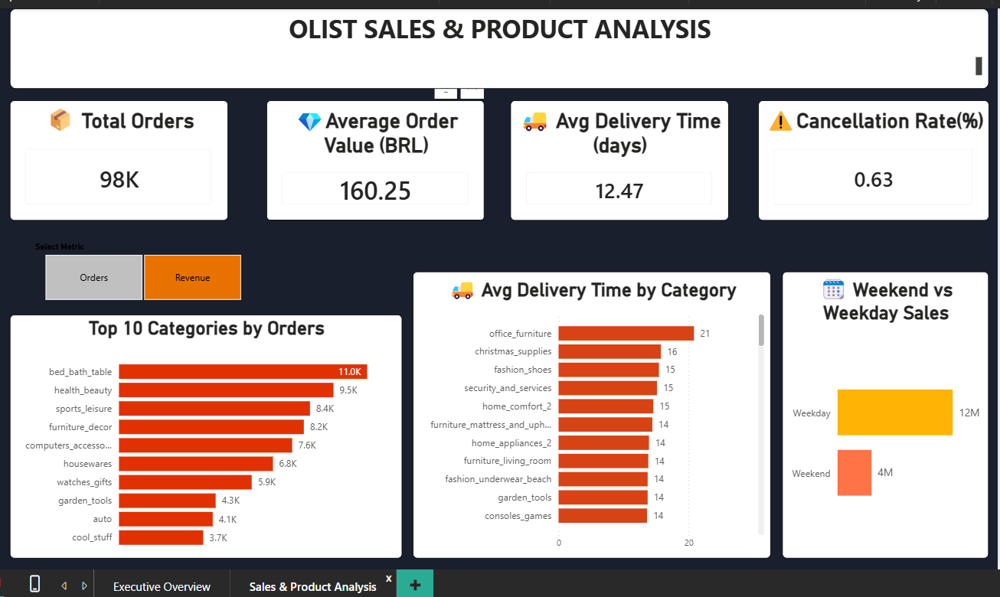

# 🛍️ Olist E-Commerce Dashboard — SQL + Power BI Project

> An end-to-end data analysis project on the **Brazilian Olist E-Commerce public dataset** — from raw PostgreSQL data to an executive-grade Power BI dashboard.

---
## Dashboard Preview
Page 1 — Executive Overview


Page 2 — Sales & Product Analysis



## 📌 Project Overview

This project analyzes ~99,000 orders from the Olist Brazilian e-commerce marketplace (2016–2018) and surfaces actionable insights for executives through a **2-page Power BI dashboard**.

- **Page 1 — Executive Overview**: Revenue trend, customer segmentation, top states
- **Page 2 — Sales & Product Analysis**: Category performance, delivery times, weekend vs weekday behavior

The project was built as part of a SQL end-to-end bootcamp and enhanced with intermediate-to-advanced Power BI patterns (DAX, disconnected tables, dynamic measures, enriched tooltips).

---
## 🎯 Business Problems Solved
This dashboard is not a technical showcase — it answers six concrete business questions that Olist's commercial and operations leadership face every quarter. Each problem below is mapped to the data finding, the dashboard visual that surfaces it, and the executive decision it enables. The goal is to make every chart on the dashboard defensible: if an executive asks "why does this chart exist?", the answer is one of the six problems below.

### Problem 1 — Geographic Revenue Concentration Risk

**The question a VP of Commercial would ask:**

> "If São Paulo sneezes, do we catch a cold? How much of our revenue depends on a single state?"

**What the data shows:**

São Paulo (SP) alone drives **R$5.77M (37%)** of total revenue with 40,501 orders. The top three states — SP, RJ, MG — together generate **R$9.64M (63%)** of revenue. The remaining 24 states share only 37% of the business. This is a textbook single-market dependency: a regulatory change, a regional logistics disruption, or a competitor push in the Southeast could materially impact the entire P&L. At the same time, the average order value in underpenetrated states like BA (R$160) is **29% higher** than in SP (R$124) — meaning the markets Olist has not yet captured are, per order, more valuable than the market it dominates.

**How the dashboard answers it:** The "Top 10 States by Revenue" bar chart on Page 1, with enriched tooltips showing revenue, order count, average delivery days, and average order value per state in a single hover. An executive can scan the chart in 5 seconds and immediately see both the concentration and the per-order upside of expansion markets.

**The decision it enables:** Whether to (a) double down on SP with deeper inventory investment and faster delivery promises, or (b) launch growth programs in underpenetrated high-AOV states like BA, DF, and GO. Both strategies are valid — the dashboard's job is to surface the tradeoff, not to make the choice.

---

### Problem 2 — Category Portfolio Dependency

**The question a Category Manager would ask:**

> "Which categories are carrying the business, and how exposed are we if one of them drops?"

**What the data shows:**

The top 10 categories generate **R$9.53M (62%)** of revenue. `health_beauty` (R$1.41M, 9,465 orders), `watches_gifts` (R$1.26M, 5,859 orders), and `bed_bath_table` (R$1.23M, 10,953 orders) are the three pillars. Notably, `watches_gifts` delivers near-equivalent revenue to `bed_bath_table` with **half the order volume** — it is a high-AOV category that punches above its weight. Losing a single top seller in `watches_gifts` could cost more revenue than a five-category drop in `housewares`. This asymmetry is invisible if you only look at revenue; it only becomes apparent when you compare revenue per order across categories, which is exactly what the dashboard's Revenue/Orders toggle is designed to expose.

**How the dashboard answers it:** The dynamic "Top 10 Categories" bar chart on Page 2 — users toggle between Revenue and Orders via a slicer (disconnected-table pattern with DAX `SWITCH` + `SELECTEDVALUE`). Flipping between the two views reveals which categories are volume drivers (e.g., `bed_bath_table` — many orders, moderate revenue) vs. value drivers (e.g., `watches_gifts` — fewer orders, high revenue).

**The decision it enables:** Where to invest in exclusive seller partnerships and expanded assortment (high-AOV categories like `watches_gifts` and `computers_accessories`) vs. where to optimize fulfillment cost and turnaround (high-volume categories like `bed_bath_table` and `sports_leisure`).

---

### Problem 3 — Delivery Time SLA Breaches in Bulky Categories

**The question a Head of Operations would ask:**

> "Which categories are consistently breaching our delivery promise, and why?"

**What the data shows:**

The catalog-wide average delivery time is around **12 days**, but several categories massively overshoot: `office_furniture` at **20.8 days** (73% above average), `christmas_supplies` (15.7), `fashion_shoes` (15.4), `furniture_mattress_and_upholstery` (14.4), and `home_appliances_2` (13.9). The pattern is clear and physical: **bulky, heavy, or oversized items** take 50–70% longer to deliver than the platform average. By contrast, fast-moving consumables like `food` (9.6 days) and `party_supplies` (9.3) deliver well under the average. A buyer who orders a mattress and a party decoration in the same week receives the party supplies in 9 days and waits another 5 days for the mattress — and blames Olist, not the seller.

**How the dashboard answers it:** The "Avg Delivery Time by Category" chart on Page 2 — sorted descending so the worst performers surface at the top immediately. The visual makes the bulky-category pattern impossible to miss.

**The decision it enables:** Whether to (a) introduce category-specific delivery promises at checkout (e.g., "12–18 business days for furniture"), (b) negotiate dedicated bulky-freight contracts with third-party logistics providers, or (c) require sellers in slow categories to either use Olist's fulfillment partner or risk delisting.

---

### Problem 4 — Cancellation Risk in Niche Categories

**The question a Head of Seller Quality would ask:**

> "Which categories have a cancellation problem that is eroding buyer trust?"

**What the data shows:**

Platform-wide cancellation rate is **0.63%** — healthy by e-commerce standards. But several niche categories significantly overshoot: `portateis_cozinha_e_preparadores_de_alimentos` at **6.67%** (small sample but flagrant), `dvds_blu_ray` (3.13%), `construction_tools_safety` (**2.58%** with 194 orders — meaningful volume), and `diapers_and_hygiene` (2.56%). `musical_instruments` (1.62% on 680 orders) is also worth attention because of its scale. A 2.5%+ cancellation rate at meaningful volume signals either seller-side stock issues (overselling inventory they don't have) or product-quality disputes (buyers rejecting goods on delivery). Either way, every canceled order is a customer who will think twice before buying from Olist again.

**How the dashboard answers it:** The "Cancellation Rate by Category" bonus chart on Page 2 — filtered with `HAVING COUNT(*) > 10` to exclude statistically noisy micro-categories where 1 cancellation in 3 orders would otherwise show a misleading 33% rate.

**The decision it enables:** Whether to trigger a seller audit in flagged categories, require inventory verification before listing, cap daily order acceptance for sellers with chronic cancellation patterns, or remove repeat offenders from the platform entirely.

---

### Problem 5 — Customer Retention Crisis

**The question a Head of CRM / Growth would ask:**

> "Are we a one-purchase marketplace? Why don't customers come back?"

**What the data shows:**

Only **2,801 of 93,358 customers (3.0%)** have ever placed a second order. Repeat customers contribute just **5.6%** of total revenue (R$864K of R$15.4M). Segmenting by lifetime spend reveals an even starker picture: **95.4%** of customers fall into the Low segment (<500 BRL lifetime), contributing 74.5% of revenue. The Premium segment (>1,000 BRL) is just **1.2%** of the base (1,148 customers) but drives **11.8%** of revenue. Olist is, in effect, running a one-shot acquisition engine — every new customer must be won from scratch because almost none return. The arithmetic is brutal: acquiring a new customer in Brazil costs roughly R$30–60 in paid media, but with a 3% repeat rate, the lifetime revenue per acquired customer barely clears that cost.

**How the dashboard answers it:** The "Repeat Customer Rate" KPI card on Page 1 (with revenue contribution shown alongside), plus the "Revenue by Customer Segment" bar chart with self-explanatory subtitle (Low <500 | Regular 500–1000 | Premium >1000 BRL). The segment subtitle is critical: without it, an executive would have to ask what "Low" means, breaking the self-service principle.

**The decision it enables:** Whether to launch a post-purchase retention program (loyalty tier, post-purchase email cadence, category-based re-engagement offers) — and how much budget to allocate. The math: even a 1-percentage-point lift in repeat rate (3% → 4%) represents ~930 additional repeat customers generating roughly **R$1.5M of incremental revenue** from the existing customer base, with zero acquisition spend.

---

### Problem 6 — Seasonal Capacity Planning (Black Friday Spike)

**The question a Head of Supply Chain would ask:**

> "When do we need to surge inventory, staffing, and logistics capacity — and by how much?"

**What the data shows:**

Monthly revenue grew from **R$143K (Sep 2016)** to **R$1.13M (Apr 2018)** — an 8x expansion in 19 months. But the most striking signal is **November 2017**: revenue jumped to **R$1.15M with 7,289 orders**, a **53% month-over-month spike** from October's R$751K, then dropped back to R$843K in December. This is unambiguously a Black Friday effect, and it means Olist's logistics, customer support, and seller operations must be sized to absorb a ~50% demand surge in a single month — every year. The same pattern likely repeats in November 2018 (data ends in August 2018, so this cannot be confirmed from the dataset, but the structural signal is clear).

**How the dashboard answers it:** The "Monthly Revenue Trend" line chart on Page 1, with order count and unique customer count also available in the underlying data for capacity planning. The November spike is visually unmissable on the line chart.

**The decision it enables:** When to start seasonal hiring (October), when to pre-position inventory in SP warehouses (mid-October), and how much customer-support capacity to add for the November window. Under-provisioning for November is the most expensive operational mistake Olist can make — every canceled order due to slow support during the peak window is a customer who will not return, compounding Problem 5.

---


## 🧰 Tech Stack

| Layer        | Tool                                  |
|--------------|---------------------------------------|
| Database     | PostgreSQL (via DBeaver)              |
| Querying     | SQL (CTE, JOIN, CASE WHEN, COALESCE)  |
| Modeling     | Power BI Desktop                      |
| DAX          | SWITCH, SELECTEDVALUE, CALCULATE, EDATE |
| Visualization| Power BI (Card, Line, Bar, Slicer)    |

---

## 📁 Repository Structure

```
olist-ecommerce-analysis/
├── sql/
│   ├── 01_setup.sql                  # Table renaming + column type fixes
│   └── 02_analysis_queries.sql       # 10 bootcamp questions + bonus KPIs
├── screenshots/
│   ├── page1_executive_overview.png  # Dashboard Page 1
│   └── page2_sales_analysis.png      # Dashboard Page 2
└── README.md
```

> The `.pbix` file and CSV outputs are intentionally excluded via `.gitignore`. The SQL scripts fully reproduce every CSV fed into the dashboard.

---

## 🗂️ Data Source

- **Dataset**: Brazilian E-Commerce Public Dataset by Olist
- **Tables used**: `customers`, `orders`, `order_items`, `products`, `product_category_name_translation`
- **Volume**: ~99,000 orders, ~R$15.4M total revenue, 2016–2018

---

## 🔑 Key Analytical Questions Answered

| # | Question | Output | Dashboard |
|---|----------|--------|-----------|
| 1 | Monthly revenue trend | `monthly_revenue.csv` | Page 1 — Line chart |
| 2A | Top 10 categories by revenue | `top_categories_revenue.csv` | Page 2 — Bar chart |
| 2B | Top 10 categories by order count | `top_categories_orders.csv` | Page 2 — Bar chart |
| 3 | Customer segmentation by spend (Low/Regular/Premium) | `customer_segments.csv` | Page 1 — Bar chart |
| 4 | Average order value by category | `aov_by_category.csv` | Page 2 — Bonus chart |
| 5 | Repeat customer rate & revenue contribution | `repeat_customers.csv` | Page 1 — KPI card |
| 6 | Top 10 states by revenue | `top_states.csv` | Page 1 — Bar chart |
| 7 | Avg delivery time by category | `delivery_by_category.csv` | Page 2 — Chart 3 |
| 8 | Cancellation rate by category | `cancellation_by_category.csv` | Page 2 — Bonus chart |
| 9 | Top 10 sellers by revenue | `top_sellers.csv` | Page 2 — Bonus chart |
| 10 | Weekend vs weekday sales | `weekend_vs_weekday.csv` | Page 2 — Chart 4 |

---

## ✨ Dashboard Highlights

### Page 1 — Executive Overview
- 3 KPI cards: Total Revenue (R$15.42M), Total Customers (95K), Repeat Customer Rate (3%)
- Monthly Revenue Trend line chart (2016–2018)
- Revenue by Customer Segment bar chart with self-explanatory subtitle
- Top 10 States by Revenue bar chart with enriched multi-metric tooltips

### Page 2 — Sales & Product Analysis
- 4 KPI cards: Total Orders, AOV, Avg Delivery Time, Cancellation Rate
- **Dynamic Top 10 Categories chart** — users toggle between **Revenue** and **Orders** via a slicer (disconnected-table pattern + DAX `SWITCH` + `SELECTEDVALUE`)
- Avg Delivery Time by Category chart
- Weekend vs Weekday sales comparison

---

## 🧠 Engineering Decisions & Lessons Learned

### 1. Data accuracy fix — Cancellation Rate KPI
The original Global KPIs query used `WHERE order_status != 'canceled'` to compute revenue from realized orders. This filter silently broke the cancellation-rate calculation (it returned `0.0%` because canceled rows were filtered out before being counted).

**Fix**: Split into two separate queries — one for revenue (with filter), one for cancellation rate (without filter). Data accuracy > convenience.

### 2. Disconnected table pattern for dynamic metrics
Instead of building two separate bar charts for "Top 10 Categories by Revenue" and "Top 10 Categories by Orders", I used a **disconnected table** (`MetricSelector`) + a DAX `SWITCH` measure (`SelectedMetricValue`) + a slicer. The chart title is also dynamic via **Field Value formatting** (`SelectedMetricTitle`).

### 3. Enriched tooltips — context over single metrics
The Top 10 States chart shows not only revenue but also total orders, avg delivery days, and avg order value in its tooltip. Following Microsoft/Amazon executive-reporting principles: a single metric is half-analysis — context is what enables decisions.

### 4. SQL readability — COALESCE for category translation
Category names are stored in Portuguese. A `LEFT JOIN` to `product_category_name_translation` combined with `COALESCE` lets the dashboard prefer English names but gracefully fall back to Portuguese when a translation is missing.

---

## 🚀 How to Reproduce

1. **Database setup**
   - Create a PostgreSQL database
   - Import the 9 Olist CSV files (customers, orders, order_items, products, etc.)
   - Run `sql/01_setup.sql` to rename tables and fix column types

2. **Run analysis queries**
   - Open `sql/02_analysis_queries.sql` in DBeaver
   - Execute each query and export the result as CSV (filenames are noted in query comments)

3. **Build the dashboard**
   - Open Power BI Desktop
   - Get Data → Text/CSV → load all exported CSVs
   - Recreate the visuals per the highlights above
   - Apply the DAX measures documented in the Engineering Decisions section

---


## 📄 License

This project is for educational and portfolio purposes. The underlying dataset is publicly available from Olist on Kaggle.

---

## 👤 Author

Sena Erdem — Data Analyst in training
- LinkedIn: https://www.linkedin.com/in/sena-erdem-a64b91345/
- GitHub: https://github.com/senaerdemm2

---

> Built as part of a SQL end-to-end bootcamp. Feedback welcome.
